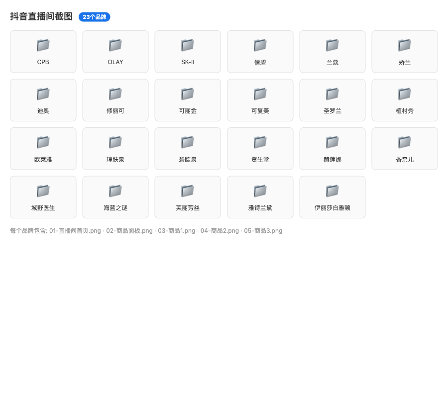

# 抖音直播间批量监控工具

自动化采集抖音品牌直播间的商品截图信息，通过 **Claude Code（AI 对话式驱动）** + **Playwright（浏览器自动化）** 实现。

## 技术栈

| 层级 | 技术 | 用途 |
|------|------|------|
| **AI 编排层** | Claude Code + SKILL.md | 接收自然语言指令，拆解为浏览器操作步骤，驱动 Playwright MCP 执行 |
| **浏览器自动化** | Playwright MCP（@playwright/mcp） | 操作 Chromium 浏览器：搜索、导航、点击、截图 |
| **配置面板** | Python 3（http.server）+ HTML/JS | 本地 Web 服务，提供品牌配置、进度监控 UI |
| **数据存储** | JSON 文件（config.json / status.json） | 配置持久化、运行状态实时同步 |
| **Cookie 管理** | JSON 文件（douyin_cookies.json） | 登录态持久化，避免重复扫码 |

### 架构图

```
┌─────────────────────────────────────────────────┐
│                 用户自然语言输入                    │
│   "看直播间 兰蔻,SK-II,赫莲娜"                    │
└──────────────────┬──────────────────────────────┘
                   │
┌──────────────────▼──────────────────────────────┐
│  Claude Code (AI 推理引擎)                       │
│  读取 SKILL.md → 拆解步骤 → 调用 Playwright MCP  │
└──────────────────┬──────────────────────────────┘
                   │
┌──────────────────▼──────────────────────────────┐
│  Playwright MCP (浏览器自动化层)                  │
│  ├─ browser_navigate    → 打开搜索/直播间页面      │
│  ├─ browser_snapshot    → 读取页面结构            │
│  ├─ browser_run_code_unsafe → JS 点击/操作         │
│  ├─ browser_take_screenshot → 截图                │
│  └─ browser_tabs        → 标签页管理               │
└──────────────────┬──────────────────────────────┘
                   │
┌──────────────────▼──────────────────────────────┐
│  抖音 Web (目标平台)                              │
│  搜索 → 进入直播间 → 小黄车 → 商品详情             │
└─────────────────────────────────────────────────┘

         ┌──────────────────┐
         │  前端配置面板      │  ←── bash start.sh
         │  Python + HTML/JS │
         │  config.json      │
         │  status.json      │
         └──────────────────┘
```

## 功能

- **批量采集** — 一次输入多个品牌，逐个自动处理
- **智能搜索** — 自动搜索品牌直播间，优先选择官方旗舰店
- **首页截图** — 进入直播间后截取直播画面
- **小黄车采集** — 自动展开商品列表，截图商品面板
- **商品详情** — 逐个点击前 3 个商品，截图详情页
- **前端面板** — 可视化配置品牌、实时查看进度和日志
- **状态同步** — 采集进度实时写入 status.json，前端自动轮询更新
- **反风控策略** — 品牌间等待间隔、标签页管理、重试机制

## 截图效果

采集完成后，每个品牌在桌面生成如下目录结构：

```
~/Desktop/抖音直播间截图/{品牌}/{YYYY-MM-DD}/
├── 01-直播间首页.png
├── 02-商品面板.png
├── 03-商品1.png      ← 商品详情浮层
├── 04-商品2.png
└── 05-商品3.png
```

## 前置要求

- [Claude Code](https://claude.ai/code) — Anthropic 的 AI 命令行工具
- [Playwright MCP](https://github.com/microsoft/playwright-mcp) — 浏览器自动化 MCP 服务
- Node.js（运行 Playwright MCP）
- Python 3（运行配置面板）
- 抖音账号（用于扫码登录）

## 安装

### 1. 克隆仓库

```bash
git clone https://github.com/liqunqun07/douyin-livestream-monitor.git
cd douyin-livestream-monitor
```

### 2. 安装为 Claude Code Skill

```bash
mkdir -p ~/.claude/skills
cp -r douyin-livestream-monitor ~/.claude/skills/
```

### 3. 配置 Playwright MCP

编辑 `~/.claude/settings.json`，添加 Playwright MCP 配置：

```json
{
  "mcpServers": {
    "playwright": {
      "type": "stdio",
      "command": "npx",
      "args": ["@playwright/mcp"]
    }
  }
}
```

首次使用需要安装 Playwright 浏览器：

```bash
npx playwright install chromium
```

### 4. （可选）启动配置面板

```bash
cd ~/.claude/skills/douyin-livestream-monitor
bash start.sh
```

浏览器会自动打开 http://localhost:7890 配置面板。

## 操作步骤

### 完整工作流程

```
步骤 1 ── 启动配置面板（可选）
          bash start.sh
          └─ 浏览器打开 → 填写品牌列表 → 保存配置

步骤 2 ── 进入 Claude Code 终端
          claude

步骤 3 ── 输入采集指令
          方式 A: "看直播间 兰蔻,SK-II,赫莲娜"
          方式 B: "提取城野医生、OLAY、芙丽芳丝、可复美"
          方式 C: 先在前端面板配置好品牌，再输入 "看直播间"

步骤 4 ── Claude Code 自动执行
          ├─ 打开抖音 → 注入 Cookies → 验证登录
          ├─ 对每个品牌：
          │   ├─ 搜索直播间（URL: /search/{品牌}?type=live）
          │   ├─ 进入官方直播间
          │   ├─ 截图直播间首页
          │   ├─ 点击「全部商品」展开小黄车
          │   ├─ 截图商品面板
          │   ├─ 点击第 1 个商品 → 截图 → 缩小返回
          │   ├─ 点击第 2 个商品 → 截图 → 缩小返回
          │   ├─ 点击第 3 个商品 → 截图
          │   └─ 关闭标签页 → 等待 → 下一个品牌
          └─ 全部完成 → 输出结果汇总

步骤 5 ── 查看结果
          截图保存在 ~/Desktop/抖音直播间截图/{品牌}/2026-05-19/
```

### 详细操作说明

#### 方式一：前端面板配置 + Claude Code 执行（推荐）

适合批量操作、需要可视化监控的场景。

**启动配置面板：**
```bash
cd ~/.claude/skills/douyin-livestream-monitor
bash start.sh
```

浏览器打开配置面板后：
1. 在文本框输入品牌（逗号隔开），例如 `兰蔻, 雅诗兰黛, SK-II, 赫莲娜`
2. 设置截图保存路径（默认 `~/Desktop/抖音直播间截图`）
3. 点击「保存配置」
4. 点击「▶️ 开始采集」— 面板状态变为等待中

切换到 Claude Code 终端：
5. 输入 `看直播间`
6. Claude Code 开始采集，面板实时显示进度、当前品牌、步骤日志

#### 方式二：纯语音/文字指令

不需要启动配置面板，直接在 Claude Code 中输入：

```text
看直播间 兰蔻,SK-II,赫莲娜,海蓝之谜
```

或中文顿号分隔：

```text
提取城野医生、OLAY、芙丽芳丝、可复美
```

#### 方式三：混合模式

先配置保存路径和品牌列表，然后执行：

```text
看直播间
```

Claude Code 会自动读取 `config.json` 中的配置。

### 首次使用 — 登录

第一次运行时需要扫码登录抖音：

1. Claude Code 自动打开抖音首页
2. 检测到未登录 → 提示扫码
3. 在浏览器中完成扫码登录
4. Cookies 自动保存到 `~/.claude/douyin_cookies.json`
5. 后续使用自动加载，无需重复登录

如果 Cookies 过期，会再次提示扫码。

## 项目结构

```
douyin-livestream-monitor/
│
├── SKILL.md              # ★ Claude Code Skill 定义（核心指令文档）
│                          #   告诉 Claude 如何执行采集的每个步骤
│
├── README.md             # 本文件
│
├── start.sh              # 启动配置面板的入口脚本
│
├── monitor.py            # 独立运行脚本（不依赖 Claude Code 时使用）
│
├── frontend/             # Web 配置面板
│   ├── index.html        # 前端 UI（配置表单 + 状态面板 + 日志）
│   └── server.py         # 后端 API（Python 标准库 http.server）
│
├── references/           # 参考文档
│   └── douyin-ui.md      # 抖音页面结构实测记录
│
├── evals/                # Skill 评测用例
│   └── evals.json        # 测试 prompt 和预期结果
│
├── config.json           # 用户配置（已 .gitignore）
├── status.json           # 运行状态（已 .gitignore）
└── .gitignore
```

## 采集流程详解

### 1. 输入解析
- 支持 `,`、`、`、`；`、`;` 多种分隔符
- `SK2` / `sk2` 自动映射为 `SK-II`
- 同时读取 `config.json`（前端面板配置），用户指令优先

### 2. 登录管理
- 打开抖音首页，注入已保存 Cookies
- 验证登录状态（`a[href*="/user/self"]` 是否存在）
- 未登录则提示扫码，等待 120 秒

### 3. 搜索直播间
- 构造搜索 URL：`https://www.douyin.com/search/{品牌}?type=live`
- 定位「直播中」卡片，优先选择有「认证徽章」的直播间
- 直接 navigate 到直播间 URL 进入

### 4. 截图直播间首页
- 进入后等待加载，截取全屏

### 5. 商品面板（小黄车）
- 找到「全部商品」按钮（右侧面板底部）
- 使用 JavaScript dispatchEvent 点击（绕过遮罩层拦截）
- 处理可能的「同意」协议弹窗
- 截图商品列表

### 6. 商品详情
- 使用 `[data-e2e="promotion-title"]` 定位商品
- 点击 → 等待详情浮层加载 → 截图
- 点击右上角「缩小」SVG 图标返回列表（不可用 Escape 键）
- 重复 3 次，截取前 3 个商品

## 截图效果参考



*采集完成后，23个品牌的直播截图按文件夹整理，每个品牌包含 5 张截图。*

### 7. 品牌间等待
- 每个品牌完成后关闭标签页
- ≤5 个品牌：等待 1-2 秒
- 5-10 个品牌：等待 3-5 秒
- >10 个品牌：等待 5-8 秒，每 5 个额外等待 15 秒

## 注意事项

- **风控**：抖音有反爬机制，遇到验证码/滑块需手动处理
- **标签页**：每个品牌处理完后自动关闭标签页，防止堆积
- **Cookies**：保存在 `~/.claude/douyin_cookies.json`，不要提交到 Git
- **截图超时**：如果卡住，Claude 会自动改用 `page.screenshot()` 重试
- **合规**：本工具仅供学习研究使用，请遵守抖音用户协议

## 已知问题 / Known Issues

### 1. 采集速度较慢

每个品牌需要依次完成：搜索 → 进入直播间 → 截图首页 → 展开小黄车 → 截图商品面板 → 截图前 3 个商品详情。整个过程受限于网络加载速度和抖音风控策略，每个品牌约需 30-60 秒。大批量采集时建议合理安排品牌数量。

### 2. 前端配置面板体验欠佳

Web 配置面板（`frontend/`）基于 Python http.server 和轮询 JSON 文件实现，功能较为基础：
- 没有 WebSocket 实时推送，日志和状态通过 1.5 秒轮询更新
- 界面设计简单，缺少错误恢复等交互能力
- "开始采集"按钮只是标记状态，实际仍需切换到 Claude Code 终端执行命令

### 3. 后端 CLI 命令稳定可靠

尽管前端体验一般，但直接通过 Claude Code 命令行执行采集（方式二/三）非常稳定：
```
看直播间 兰蔻,SK-II,赫莲娜,海蓝之谜
```
推荐优先使用命令行方式。如果后续需要更好的前端体验，可以考虑替换为基于 WebSocket + React 的现代面板。

## License

MIT
